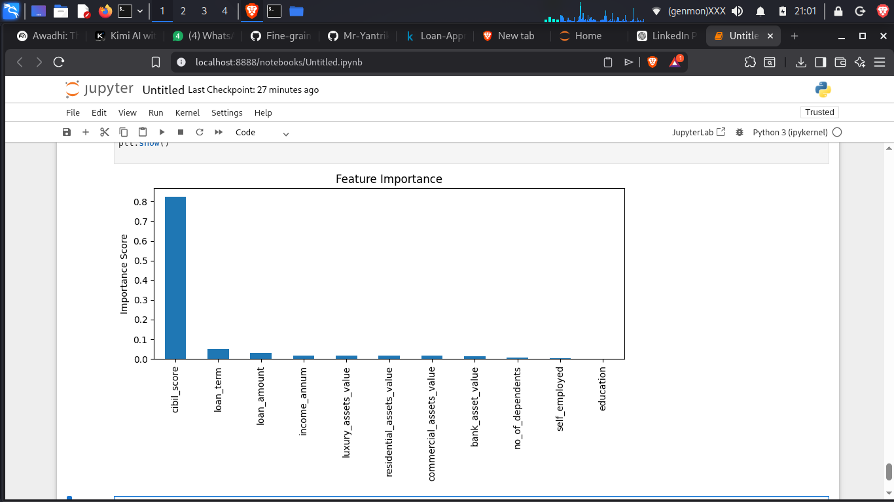
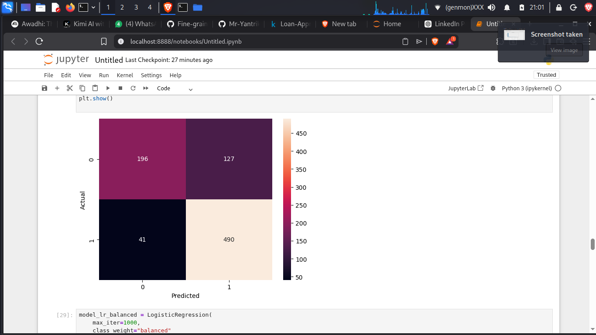

# Loan Approval Prediction using Machine Learning

## Project Overview

This project builds a supervised machine learning model to predict whether a loan application will be Approved or Rejected based on financial and credit-related attributes.

The objective is to simulate a real-world banking risk assessment system using structured preprocessing, classification models, and performance evaluation techniques.

---

## Problem Statement

Financial institutions must evaluate loan applications efficiently while minimizing credit risk. This project develops a binary classification model that predicts:

1 → Approved  
0 → Rejected  

The model is evaluated using precision, recall, F1-score, and confusion matrix analysis.

---

## Dataset Information

Dataset Name: Loan-Approval-Prediction-Dataset  
Total Records: 4,269  

Target Distribution:
- Approved: 62.2%
- Rejected: 37.8%

The dataset is moderately imbalanced, therefore stratified splitting and class weighting were applied during training.

---

## Features Used

- no_of_dependents
- education
- self_employed
- income_annum
- loan_amount
- loan_term
- cibil_score
- residential_assets_value
- commercial_assets_value
- luxury_assets_value
- bank_asset_value

---

## Data Preprocessing Steps

- Removed identifier column (loan_id)
- Cleaned string formatting inconsistencies
- Encoded categorical variables (education, self_employed)
- Converted target labels to binary format
- Applied stratified 80-20 train-test split
- Handled moderate class imbalance using class_weight parameter

---

## Models Implemented

1. Logistic Regression (Baseline)
2. Logistic Regression (Balanced)
3. Random Forest Classifier (Final Model)

Final Model Configuration:
- n_estimators = 300
- class_weight = balanced
- random_state = 42

---

## Final Model Performance (Random Forest)

Accuracy: 98%

Classification Performance:

Class 0 (Rejected)
- Precision: 0.98
- Recall: 0.97
- F1-Score: 0.97

Class 1 (Approved)
- Precision: 0.98
- Recall: 0.99
- F1-Score: 0.98

The Random Forest model demonstrated strong predictive performance across both classes.

---

## Feature Importance Analysis

Feature importance analysis revealed that CIBIL score is the most influential predictor, contributing over 80% of the model’s decision power.

This reflects real-world financial decision systems where credit score plays a critical role in loan approvals.

---

## Confusion Matrix

The confusion matrix shows minimal misclassification between approved and rejected loan applications.

---

## Technologies Used

- Python
- Pandas
- NumPy
- Scikit-learn
- Matplotlib
- Seaborn

---

## Project Structure

loan-approval-ml/
│
├── data/
│   └── loan_approval_dataset.csv
│
├── images/
│   ├── confusion_matrix.png
│   └── feature_importance.png
│
├── notebooks/
│   └── loan_analysis.ipynb
│
├── requirements.txt
└── README.md

---

## Installation

Clone the repository:

git clone <https://github.com/Mr-Yantrik/Loan-Approval-Prediction-ML>

cd loan-approval-ml

Install dependencies:

pip install -r requirements.txt

Run the notebook:

jupyter notebook

---

## Conclusion

This project demonstrates the practical application of classification algorithms in financial decision modeling. Ensemble learning techniques such as Random Forest significantly improved predictive performance compared to linear models.

The analysis highlights the dominant influence of credit score in loan approval decisions.
